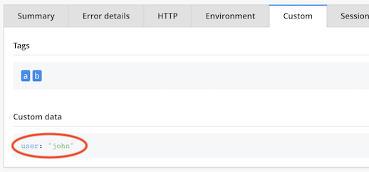

# Approach

>This file contains background information. Useful for curious people and co-authors.

## This is a stand-alone client

- One should not need to turn to the [`raygun4js`](https://github.com/MindscapeHQ/raygun4js) docs, nor even be aware of its existence.

- There doesn't need to be feature parity with the plain client.

## Playground to serve for tests (to be done)

See [#1](https://github.com/akauppi/rg4esm/issues/1).

## How things are seen in the Raygun Dashboard

Raygun plain client keeps features aligned to the Crash Reporting / Real User Monitoring boxes. This is meaningful when one considers the products are separately purchased from Raygun. However, it is not always clear to the developer (at least, the author) when a call works in either of such boxes.

>Note: This seems to be a puzzle for Raygun itself - why else would web app performance monitoring live under "Real User Monitoring" and not "Application Performance Monitoring", except for that APM is not sold for web front-ends. It becomes arbitrary - please Raygun, consider cutting the product silos and sell a "web app monitoring" that covers all current functionality. You can then proceed to tailor the Dashboard so that unnecessary things (&lt;cough&gt;server-side&lt;/cough&gt;) no longer clutter a web app's monitoring experience! 🌞

The approach taken in this client is to both a) adjust to Raygun silos, and b) screw them.

### a) Adjust to Raygun silos

The configuration is separate for the Error Monitoring and Real User Monitoring offerings (since you need to purchase them separately). This makes it easy to see, which features one has (hint: take both!).

### b) Screw silos

We misuse Raygun data structures, at places, to bring meaningful information to where you, as a devop, would likely want to see it. Here's an example of showing the user id at Error Monitoring:

In contrast, plain API `setUser` only works with Real User Monitoring. You don't see within Crash Reports, which user was affected by an error.

We piggy back the user id as custom data, automatically.
