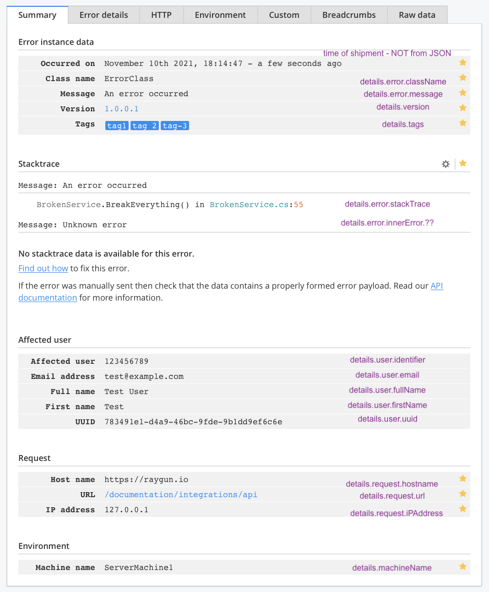
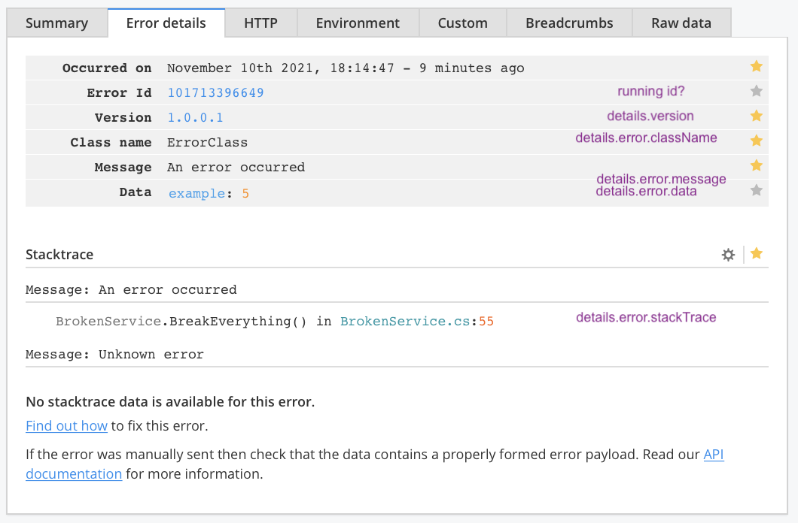
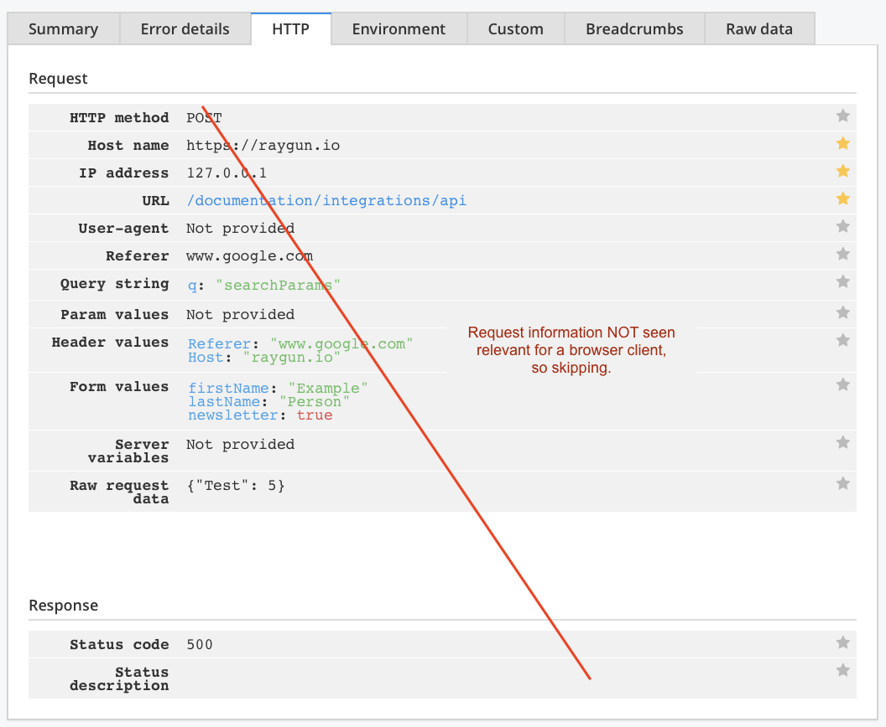
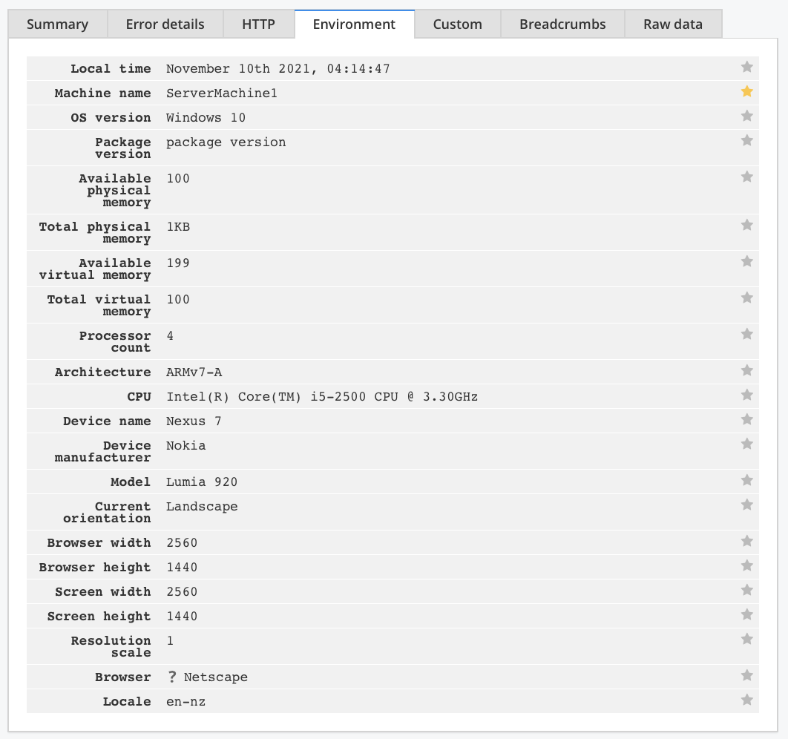
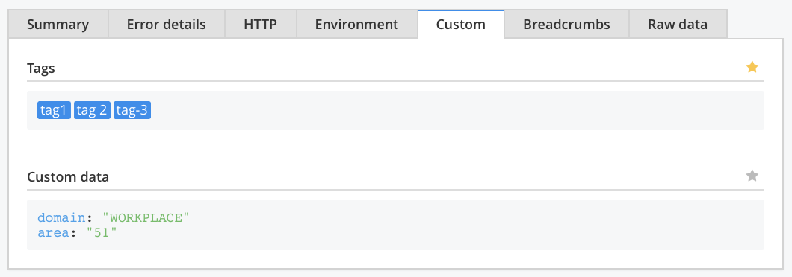
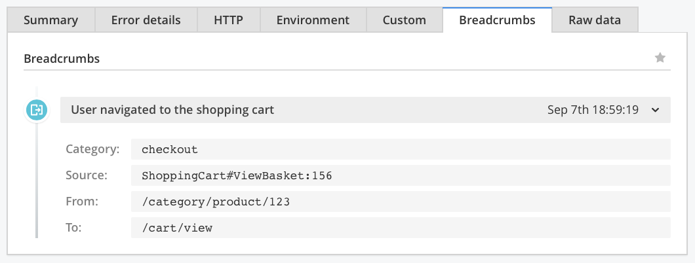

# Error Monitoring

Sending the Raygun [sample JSON](https://raygun.com/documentation/product-guides/crash-reporting/api/) to the service, this is where the data ends up:

<!-- REMOVE
||visible in dashboard|
|---|---|
|`occurredOn`||
|**`details.`**||
|&nbsp;&nbsp;`machineName`||
|&nbsp;&nbsp;`groupingKey`||
-->

## Summary

Notes:

- `Occurred on` is NOT the time stamp in the sample (`2015-09-08T01:55:28Z`). Instead, an `OccurredOn` (beginning with a capital `O`) is added with the time of the shipment of the error. One can see this in the `Raw data` tab.

   <!-- tbd. What if `occurredOn` is shipped with capital??? -->   
   

>

## Error details

>

## HTTP

This information is not relevant for a browser client. 

>Idea: Raygun dashboard could render client-side errors differently, making the layout more relevant to the particular application (and/or error).

<!-- Skipping since not relevant for browser client
>
-->

<!-- tbd. We could store page information here, also for SPAs.
-->

# Environment

>

---

# Custom 

>

# Breadcrumbs

>
