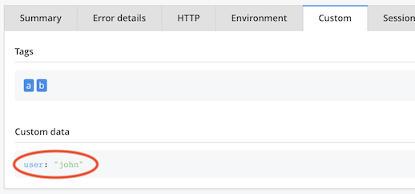

# API Design

## Unifying the API approach

Raygun [Plain JS](https://github.com/MindscapeHQ/raygun4js) API keeps features aligned to the Crash Reporting / Real User Monitoring boxes. This is meaninful when one considers the products are separately purchased from Raygun. However, it is not always clear to the developer (at least, the author) when a call works in either of such boxes.

The approach taken in this client is to screw the boxes. You are required to buy both products, and we try to make a unified experience where collected things are visible in the dashboard where you'd likely look for it.

### Example: current user

Plain API `setUser` only works with Real User Monitoring. You don't see within Crash Reports, which user was affected by an error.

This client sets the current user as Error "custom data", making it visible also under Crash Reporting > `Custom`.

