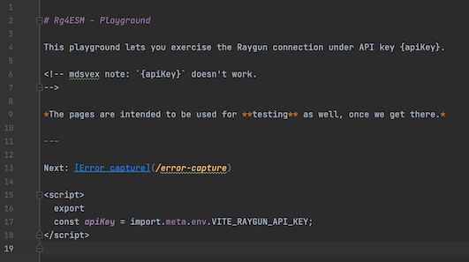

# Track

Things that are `playground` specific. See `../TRACK.md` for the whole repo.

---

## 🦞🦞🦞 Mdsvex syntax highlighting in WebStorm

*read: MadSvex? ;)*

This is a major turnoff for WebStorm / mdsvex use at the moment (Dec 2021).

[Mdsvex](https://mdsvex.com) allows writing web apps using Markdown and *I'm definitely not going away from it*. It simplifies text intensive things like the Playground.

The problem is that there's currently absolutely no highlighting for the `.svelte.md` files (or whatever you want to call them); this is more important because this kinds of files bundle in so many formats. `.svelte` has CSS, JavaScript and HTML. A `.svelte.md` syntax highlighter should be capable of handling Markdown as well (and Svelte-like espaces from it, as shown by the below example):



There is a [MDX plugin](https://plugins.jetbrains.com/plugin/14944-mdx).

*tbd. Ticket to suggest and follow this...*

*Note: Official postfix for mssvex is `.svx`.*


## SvelteKit: unnecessary dev warning: `received an unexpectd slot "default"`

Discussed in:

- [&lt;Routes&gt; received an unexpected slot "default".](https://github.com/sveltejs/kit/issues/981) (Svelte/kit)
- ...leads to [Incorrect error message "... received an unexpected slot "default".](https://github.com/sveltejs/svelte/issues/6325) (Svelte)

- [ ] Once fixed, remove these work-arounds in route files:

   ```
   {#if false}<slot/>{/if}
   ```

## SvelteKit: problems importing a library (SSR or SPA?)

SvelteKit has multiple settings to steer the SSR/SPA (or both) approach. We shouldn't *really need to care about this* - but for the moment (Dec 2021; SvelteKit 1.0-next.202) we must.

>You can create a Vite app with npm init vite and choosing the svelte template. But it doesn't include many features from sveltekit ootb, like routing, adapters, etc.

Routing keeps me using SvelteKit. Next.

### Building as SPA


### Building as SSR


